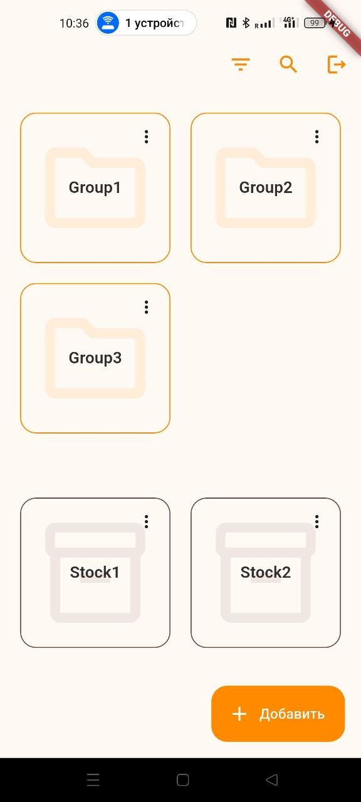
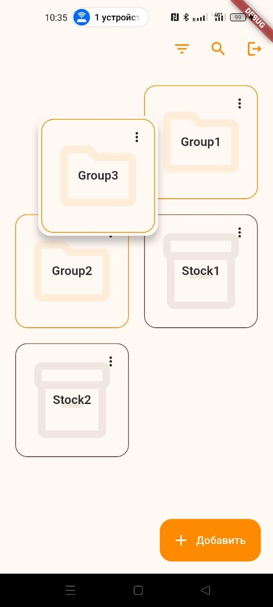
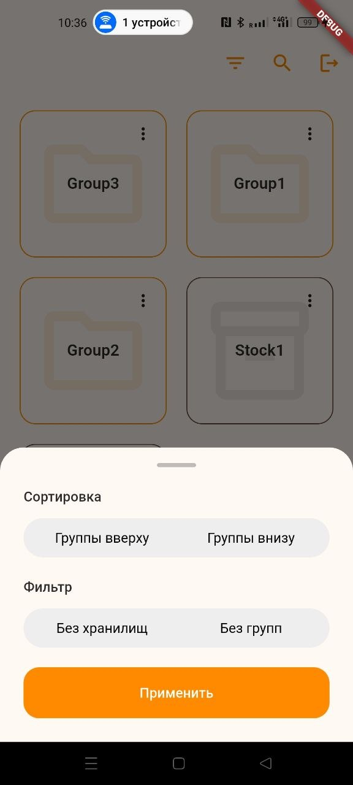
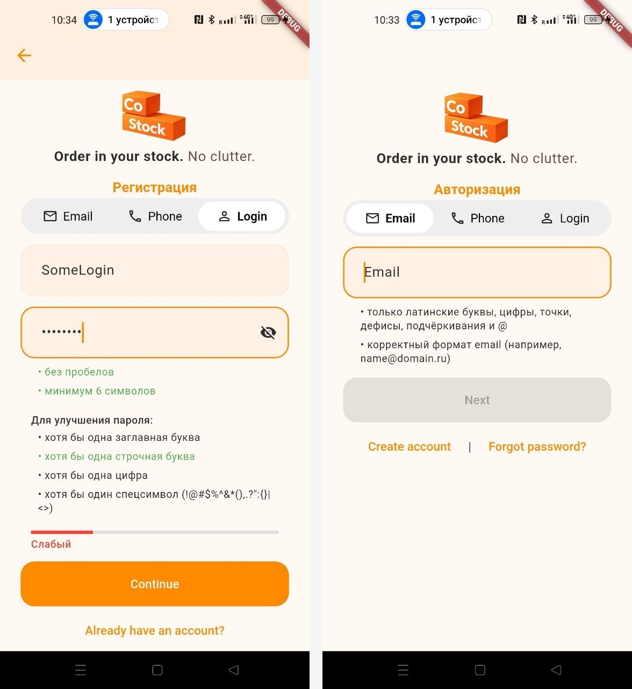

# CoStock

A Flutter mobile app concept for shared inventory management — helping families, friends, and teams keep track of what they have, what they need, and what is already being purchased.

CoStock started from a simple household problem: one person finishes an item, another person does not know about it, and someone goes shopping without knowing what is actually needed. The same idea can be applied to shared household supplies, planned meals, sports or travel equipment, event shopping, office supplies, or small business inventory.

## Overview

CoStock is designed around **shared groups and hierarchical inventories**.

Members of a group can organize items into nested groups and storage spaces, keep track of what is currently available, and eventually coordinate purchases without duplicating work.

The long-term product concept includes:

- shared inventories for families, friends, teams, and small organizations;
- collaborative shopping lists based on current stock;
- reference prices for planning purchases and estimated spending;
- product images and external purchase links;
- planned purchases visible to other group members;
- local/offline usage with synchronization and conflict resolution as a future part of the product;
- optional voice interaction as a future direction.

The household is only the original use case — the underlying model is intentionally more general.

## Current Project Status

CoStock is an actively developed personal project. The current implementation focuses on the application architecture, authentication, group management, and the core hierarchical organization model. The backend integration is planned but is not yet implemented in the mobile client.

The project was started from scratch, including product planning, database design, UI concepts, task management, branding, and the application architecture.

## Screenshots

### Shared workspace

The main workspace combines groups and storage spaces in a single customizable layout.



### Custom organization with drag & drop

Groups and storage spaces can be reordered directly through drag and drop. The application uses a custom fork of [`reorderable_grid`](https://github.com/DolBich/reorderable_grid) for this interaction.



### Filtering and sorting

The workspace provides predefined sorting modes and filters for quickly changing how groups and storages are presented.



### Authentication

The current client includes email, phone and login-based authentication flows with input validation and password requirements.

<table>
  <tr>
    <td></td>
  </tr>
</table>

## Key Features

### Hierarchical shared inventory model

The core domain is built around a tree of shared entities. Groups can contain other groups as well as storage entities, allowing users to model structures such as:

```text
Home
├── Kitchen
│   ├── Refrigerator
│   └── Pantry
└── Garage
```

The same model can represent completely different use cases without being tied to a household-specific hierarchy.

### Custom ordering and automatic sorting

Users can define their own order for entities, while also being able to switch to automatically calculated sorting modes.

These two concepts are stored separately: custom ordering represents explicit user decisions, while generated ordering can be calculated from the selected sorting strategy without storing every generated arrangement.

### Centralized tree management

Tree operations are encapsulated in a dedicated `StockTreeService` instead of being implemented directly inside the BLoC.

This keeps the complex tree manipulation logic independent from UI state and allows the same tree model to be reused by other parts of the application. It also keeps the BLoC focused on application state rather than becoming the single place where all tree algorithms live.

### Repository abstraction

The application uses repository interfaces so the UI and application logic do not depend directly on the backend implementation.

A mock repository is currently used during development, making it possible to develop and test the client without requiring the complete database layer or an active network connection. A Firebase-backed implementation is planned for the next stage of the project.

### Local-first direction

Offline usage is an important part of the product design. The architecture is being prepared for local changes followed by synchronization, including future conflict-resolution scenarios when multiple users modify the same shared data while disconnected.

The current codebase contains the abstractions and local state management needed to move in this direction; full synchronization is not implemented yet.

## Technical Highlights

- Flutter / Dart
- BLoC-based state management
- feature-oriented application structure
- repository abstractions with swappable implementations
- hierarchical domain model and dedicated tree service
- local persistence
- cancellable asynchronous operations
- custom drag-and-drop grid integration
- authentication and form validation
- image caching architecture with shared image reuse

## Architecture

The project was designed from the beginning with a separation between presentation, application/domain logic, and data access.

A simplified flow is:

```text
Flutter UI
   ↓
BLoC / application logic
   ↓
Domain models + services
   ↓
Repository interfaces
   ↓
Mock implementation today
Firebase implementation later
```

The structure was defined at the start of development, while some abstractions were introduced later as the feature set grew.

## Development Workflow

CoStock is developed independently as a personal project and also serves as a controlled environment for mentoring a junior developer.

Training tasks are isolated from the production application code: they are completed in separate branches, reviewed, and discussed independently. This keeps the main codebase fully authored and maintained by me while providing a realistic environment for practical mentoring.

## Project Goals

The project started for three reasons:

1. to build and maintain a real product around a problem I personally wanted to solve;
2. to deepen my Flutter and software architecture skills through a larger end-to-end project;
3. to create a foundation that could potentially grow into a public mobile product in the future.

## Roadmap

Planned directions include:

- completing the stock/item management flow;
- implementing the backend and synchronization layer;
- offline data synchronization and conflict resolution;
- collaborative purchase workflows;
- richer product metadata, images and links;
- preparing the application for Google Play and App Store release.

## Running the Project

The project can currently be developed against local/mock repositories without a completed backend integration.

```bash
flutter pub get
flutter run
```
